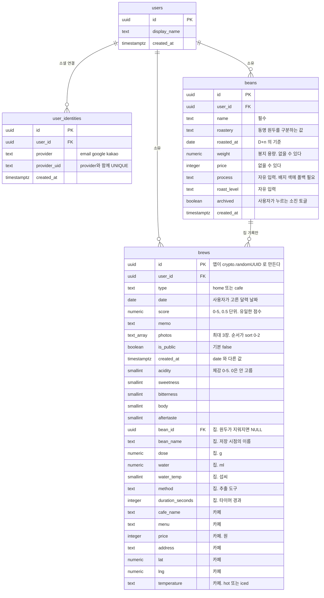

# KOI

## 폴더 구조

```
app/
├── layout.tsx                루트. html·body·폰트·전역 메타데이터
├── globals.css
├── not-found.tsx             어느 라우트에도 안 맞는 주소
└── (main)/                   라우트 그룹
    ├── layout.tsx            사이드바 + 하단탭
    ├── page.tsx              /          대시보드
    ├── beans/                /beans     원두
    ├── recipes/              /recipes   레시피
    ├── community/            /community 커뮤니티
    ├── settings/             /settings  설정
    └── brews/                /brews     기록
        ├── layout.tsx        헤더 + 목록. 목록이 여기 있어서 하위 라우트가 바뀌어도 안 다시 그려진다
        ├── page.tsx          /brews          "왼쪽에서 기록을 골라주세요"
        ├── [id]/page.tsx     /brews/1        상세. notFound() · generateMetadata
        ├── new/page.tsx      /brews/new      기록 추가
        └── not-found.tsx     없는 기록에 접근 시 보여지는 화면

components/                   *는 클라이언트 컴포넌트("use client"), 나머지는 서버
├── sidebar.tsx *             md 이상에서만 보이는 주 메뉴
├── bottom-tab.tsx *          md 미만에서만 보이는 주 메뉴
└── brews/                    기록 화면 전용
    ├── brew-panes.tsx *      목록·상세 두 칸의 배치와 가시성
    ├── brew-list.tsx *       목록 (빈 상태 포함)
    ├── brew-detail.tsx       상세 + 네이버 정적 지도
    └── brew-form.tsx *       기록 작성 폼

libs/
├── constants/routes.ts       navItems · isActiveNav
├── constants/site.ts         사이트 이름·설명·주소
├── schemas/brew.ts           기록 폼 검증 (zod)
├── mocks/brews.ts            임시 목데이터. 실제 데이터가 붙으면 지울 예정
└── utils.ts                  cn() · formatDate()

types/
└── brew.ts                   Brew = HomeBrew | CafeBrew (판별 유니온)

public/
├── favicon.svg
└── fonts/                    Pretendard (본문) — Archivo는 next/font로 받아옴
```

## 데이터베이스 스키마


